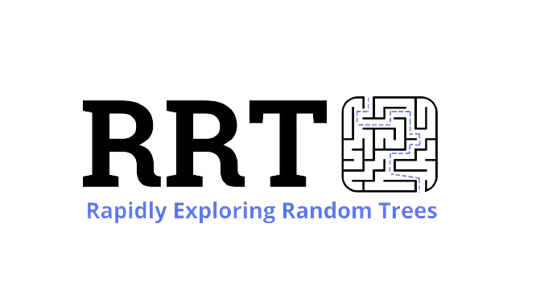

# RRT simulation in Python

El archivo RRT.py corresponde al algoritmo original
El archivo RRTplus.py corresponde al algoritmo sesgado

Para ejecutarlos, escribir el comando: python [nombre del archivo].py